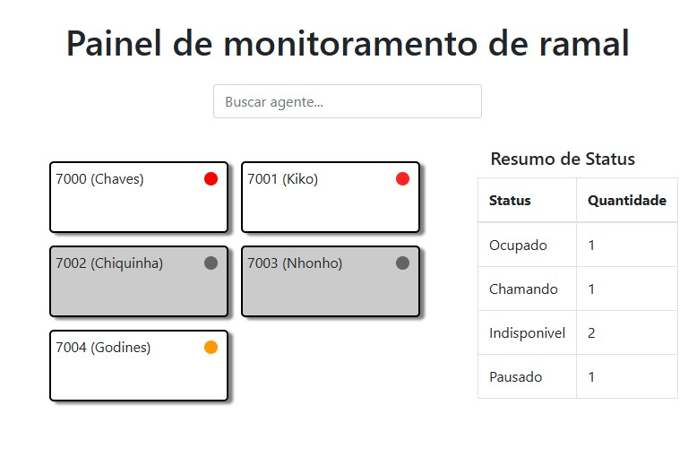
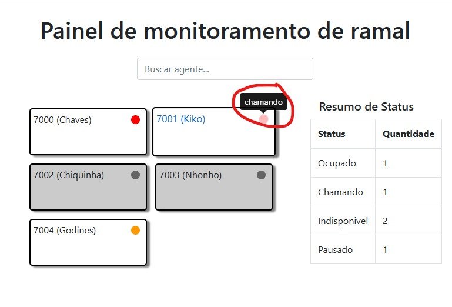
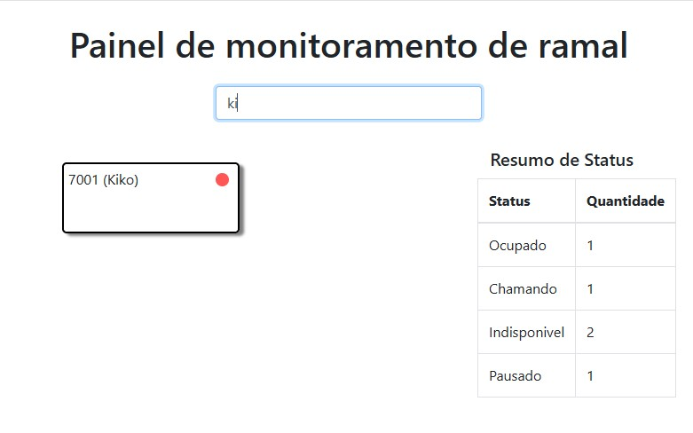
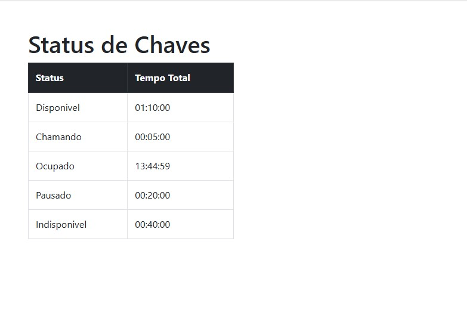

## Teste Analista Júnior — Painel de Monitoramento de Ramais

Este teste simula um cenário onde há um painel de monitoramento de ramais com bugs a serem corrigidos e melhorias obrigatórias e opcionais.

---

### Itens Corrigidos

- Os ramais indisponíveis agora são exibidos corretamente com ícone circular cinza escuro no canto superior direito.
- Os ramais em pausa no grupo SUPORTE são exibidos corretamente com ícone circular laranja.
- Os cards exibem corretamente os nomes dos agentes pertencentes ao grupo de callcenter SUPORTE (`lib/filas`).

---

### Melhorias Aplicadas

| #  | Melhoria                                                                                 | Descrição                                                                                                                                                          |
|----|------------------------------------------------------------------------------------------|--------------------------------------------------------------------------------------------------------------------------------------------------------------------|
| 1  | Resumo de Status (ao lado direito)                                                       | Uma tabela ao lado do painel exibe em tempo real a quantidade total de agentes por status atual (Ocupado, Pausado, Indisponível etc.), facilitando a visão geral. |
| 2  | Busca por Agente (nome ou número)                                                        | Campo de busca que permite filtrar os cards de ramais conforme o nome do agente ou número do ramal. A atualização é instantânea e melhora a navegação.           |
| 3  | Tooltip ao passar o mouse no círculo de status                                           | Ao passar o mouse sobre o ícone colorido no canto do card, um tooltip exibe o nome do status (ex: "Pausado", "Indisponível"), melhorando a usabilidade.           |
| 4  | Clique no card → Detalhamento diário de status                                           | Ao clicar em um card de agente, o usuário é levado para uma página (`detalhe.php`) que exibe quanto tempo o agente ficou em cada status durante o dia.           |

---

### Atividades Obrigatórias

| Tarefa                                                                                         | Status |
|------------------------------------------------------------------------------------------------|--------|
| Transformar `lib/ramais.php` em uma classe e utilizá-la no sistema                            | ✅     |
| Criar base de dados em MySQL para armazenar informações dos ramais                            | ✅     |
| Atualizar as informações no banco a cada 10s via AJAX                                         | ✅     |
| Não utilizar frameworks (código 100% próprio)                                                 | ✅     |

---

### Como testar

#### 1. Pré-requisitos
- PHP 7+
- MySQL ou MariaDB
- Navegador moderno

---

#### 2. Banco de Dados

Recomendado: importar o dump pronto

Use o arquivo `db/dump.sql` incluído no projeto, que já contém a estrutura e dados iniciais.

```bash
mysql -u dbuser -p callcenter < db/dump.sql
```

> Substitua `dbuser` e `callcenter` caso você tenha criado com outro nome.

Dica:
Se preferir criar manualmente, use o script abaixo e não se esqueça de atualizar os dados de conexão no arquivo `db/conexao.php`:

```php
// db/conexao.php
$host = 'localhost';
$db   = 'callcenter';
$user = 'dbuser';
$pass = 'pass123';
```

Script de criação manual:

```sql
CREATE DATABASE callcenter;
USE callcenter;

CREATE TABLE ramais (
    id INT AUTO_INCREMENT PRIMARY KEY,
    numero VARCHAR(10) UNIQUE,
    nome VARCHAR(50),
    nome_agente VARCHAR(50),
    ip VARCHAR(50),
    porta VARCHAR(50),
    online TINYINT(1),
    status VARCHAR(20),
    atualizado_em DATETIME DEFAULT CURRENT_TIMESTAMP ON UPDATE CURRENT_TIMESTAMP
);

CREATE TABLE historico_estados (
  id INT AUTO_INCREMENT PRIMARY KEY,
  nome_agente VARCHAR(100),
  status VARCHAR(20),
  data_hora DATETIME DEFAULT CURRENT_TIMESTAMP
);
```

---

#### 3. Executar o projeto

No terminal, dentro da pasta raiz do projeto:

```bash
php -S localhost:8000
```

Acesse em seu navegador (Usar porta 8000, pois o arquivo monitoramento.js está mapeando a porta 8000):  
http://localhost:8000

---

### Página extra: Detalhamento de tempo por status

Acesse por:

```
http://localhost:8000/lib/detalhe.php?agente=Chaves&inicio=2025-07-15&fim=2025-07-15
```

Mostra quanto tempo cada agente ficou em cada status durante o dia selecionado.

---

### Observações Finais

- O painel pode ser alimentado com novos dados alterando os arquivos `lib/ramais` e `lib/filas`.
- Os dados são sincronizados automaticamente a cada 10 segundos.
---

### Prints do Sistema

Abaixo estão algumas imagens do funcionamento do sistema. 

- `prints/1.jpg` → *(Painel principal, com tabela com quantidade de agentes no mesmo status)*
- `prints/2.jpg` → *(Tooltip mostrando status)*
- `prints/3.jpg` → *(Busca de agentes por nome/numero)*
- `prints/4.jpg` → *(Ao clicar no Card, poderá ver o resumo de tempo que agente passou em cada status. (Poderá alterar range de dias na url))*

As imagens estão na pasta `prints/` do projeto.

```markdown




```